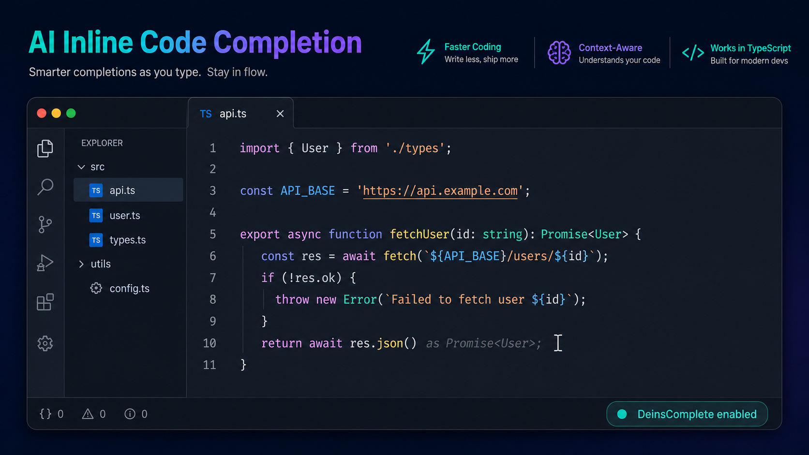

# DeinsComplete

Fast AI-powered inline code completion for VS Code.



DeinsComplete suggests code directly at your cursor as ghost text. Press `Tab` to accept a suggestion and continue coding without leaving the editor.

## Get started

1. Install the supplied `.vsix` file: **Extensions** → **…** → **Install from VSIX…**.
2. Reload VS Code when prompted.
3. Open the Command Palette (`Ctrl+Shift+P`) and run **DeinsComplete: Check Backend**.
4. Start typing code. When a suggestion appears, press `Tab` to accept it.

The extension connects to the managed DeinsComplete backend automatically. You do not need to configure an AI provider, model, API key, or provider URL. An account is optional: completions work as anonymous Free access on first run, while signing in links the installation for shared plan usage across devices.

## Try it

Create a TypeScript file and type:

```ts
const user =
```

When the development mock backend is active, the suggestion is:

```ts
await getUser();
```

You can also try:

```ts
console.
```

Use **DeinsComplete: Disable** or **DeinsComplete: Enable** to control inline suggestions at any time.

## Commands

| Command | What it does |
| --- | --- |
| `DeinsComplete: Check Backend` | Checks backend connectivity and latency. |
| `DeinsComplete: Diagnostics` | Shows privacy-safe status, cache, and request information. |
| `DeinsComplete: Show Logs` | Opens the DeinsComplete output channel. |
| `DeinsComplete: Enable` / `Disable` | Turns inline completion on or off. |
| `DeinsComplete: Clear Completion Cache` | Clears in-memory suggestions. |
| `DeinsComplete: Reset Authentication` | Requests a fresh installation credential on the next request. |
| `DeinsComplete: Sign In` | Starts optional account sign-in and links this installation. |
| `DeinsComplete: Sign Out` | Removes locally stored account credentials; the installation credential remains. |
| `DeinsComplete: Account Status` | Shows account plan and current monthly usage without exposing credentials. |

## Troubleshooting

If suggestions do not appear:

1. Ensure VS Code inline suggestions are enabled: `editor.inlineSuggest.enabled`.
2. Disable another inline-completion extension, such as Copilot, while testing.
3. Run **DeinsComplete: Check Backend**.
4. Run **DeinsComplete: Diagnostics** and **DeinsComplete: Show Logs**.

Autocomplete failures are intentionally quiet so typing remains uninterrupted.

## Privacy and security

DeinsComplete sends bounded cursor-adjacent code context to its backend only when requesting a completion. When **Repository Context** is enabled (the default), it may also send small snippets from relevant local imports and open workspace files, plus a short list of relevant package names from `package.json` (for example `tailwindcss`, `antd`, or `@mui/material`). It supports basic `tsconfig.json` path aliases and may include a bounded Tailwind configuration snippet while editing classes. It never scans the whole repository per keystroke, reads no `node_modules`, and excludes common secret, key, generated, dependency, and binary files. Turn it off per workspace with `deinscomplete.repositoryContext.enabled` when only the current file should be sent. The backend may process submitted context with configured AI providers. The extension keeps its short-lived completion cache in memory and does not require users to enter provider credentials. Installation credentials are stored in VS Code SecretStorage. Source code, tokens, and provider keys are not intentionally logged.

## Private beta

This is private beta software. Completion quality and availability can change. Do not use it with code you are not authorized to send for AI processing. See `docs/private-beta.md` for installation details and `docs/known-issues.md` if supplied with the beta.

## Development

Backend and release documentation lives in `docs/`. Production deployment uses the managed backend at `https://api.deinscomplete.web.id`; developers may override `deinscomplete.backend.url` locally.
